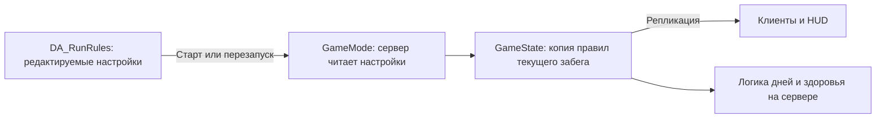

# Разработка по шагам

Каждый шаг добавляет одну понятную систему. Перед работой объясняем её назначение и зависимости, после — где искать изменения и как проверить их в редакторе. Следующий шаг начинается отдельным обсуждением после разбора результата текущего. Целевые механики описаны в [GDD](GDD.md), варианты реализации — в [техническом проекте](SystemsDesign.md).

## Шаг 1. Правила забега — сделано

**Зачем:** здоровье, число дней и лимит игроков раньше были записаны в нескольких местах кода. Теперь есть один редактируемый набор настроек. Следующие системы смогут получать правила текущего забега из общего состояния игры.

**Главный файл для дизайнера:** `Content/Data/DA_RunRules` в Content Browser Unreal. Открой его и раскрой `Settings`.

| Поле | По умолчанию | Для чего служит сейчас |
| --- | --- | --- |
| `Max Mouth Health` | 100 | Начальное здоровье рта и верхний предел восстановления; полная полоска HUD соответствует этому значению |
| `Days To Survive` | 7 | Сколько дней нужно закончить для победы; это же число показывает HUD |
| `Max Players` | 4 | Ограничение входа новых игроков и число мест в HUD; поддерживается диапазон 1–4 |
| `Initial Arena Teeth` | 8 | Подготовленная настройка начального числа зубов арены. Пока не создаёт зубы и не выдаёт возрождения |

`Initial Arena Teeth` относится к будущей системе зубов. Стартовые персонажи в это число не входят. Оставшиеся жизни впоследствии будут определяться конкретными зубами арены; этот параметр не будет убывающим счётчиком жизней.

### Как данные доходят до игры

DA — шаблон для следующего старта. GameState хранит копию, применённую к текущему забегу. Текущее здоровье находится отдельно в `MouthHealth`. Получение урона не изменяет DA. Изменение настройки в редакторе не перестраивает уже идущий забег; её прочитает следующий запуск или перезапуск хостом через R. Лимит игроков проверяется при подключении и не отключает уже находящихся в сессии людей.

### Где находится код

| Файл | Его роль |
| --- | --- |
| [MCRunRules.h](../Source/MessControl/Public/MCRunRules.h) | Новый тип Data Asset и четыре поля настроек. Здесь добавляются будущие общие правила, когда появится соответствующая система |
| [MCRunRules.cpp](../Source/MessControl/Private/MCRunRules.cpp) | Проверка значений: положительное здоровье/число дней, от одного до четырёх игроков, неотрицательное число зубов |
| [MCGameMode.cpp](../Source/MessControl/Private/MCGameMode.cpp) | Сервер читает DA при старте; использует копию правил для здоровья, победы и приёма игроков |
| [MCGameState.h](../Source/MessControl/Public/MCGameState.h) | `RunSettings` — правила активного забега; `MouthHealth` — текущее здоровье. GameState передаёт правила клиентам |
| [MCPrototypeWidget.cpp](../Source/MessControl/Private/MCPrototypeWidget.cpp) | Показывает число дней/мест из GameState и рассчитывает заполнение полоски здоровья |

Файлы с расширением `.h` описывают доступные данные и функции, `.cpp` содержит их поведение. Для настройки обычных чисел достаточно DA; менять C++ не требуется.

Дополнительно: [create_run_rules.py](../Tools/Unreal/create_run_rules.py) создаёт отсутствующий DA после сборки и сохраняет существующие настройки при повторном запуске. Это служебный скрипт; готовый DA уже входит в репозиторий. [MCGameplayTests.cpp](../Source/MessControl/Private/Tests/MCGameplayTests.cpp) содержит автоматическую проверку использования настроек. Основной генератор контента тоже умеет создать DA при восстановлении проекта с нуля.

### Как проверить самому

1. В Content Browser открой `Content → Data → DA_RunRules`, раскрой `Settings`.
2. Для короткой проверки поставь `Days To Survive = 1`, `Max Mouth Health = 60`, сохрани DA.
3. Запусти Play. HUD должен показать `DAY 01 / 01`, здоровье 60 и полную полоску.
4. Закончи задания первого дня. Должна появиться победа, а не второй день.
5. Останови Play, верни 7 дней и 100 здоровья, сохрани DA.

Автоматический тест использует отдельный временный профиль: 40 здоровья, два дня и два игрока. Он проходит два дня до победы, проверяет предел лечения и отказ третьему игроку, а также изменение профиля только на следующем старте. Рабочий `DA_RunRules` при этом не изменяется. Полный запуск проверок: `Tools/Test.ps1 -Mode Unit`.

### Граница этого шага

Этот шаг подключает настройки к существующему прототипу. Пока в нём остаются прежние упрощённые задания и правила смены дня. Восемь игровых зубов, их статусы, расходование на возрождение и чистка стуками — следующие самостоятельные системы. Наличие поля в DA не означает, что эти механики уже работают.

## Дальнейшая последовательность — план

| Следующий шаг | Что станет проверяемым | На что опирается |
| --- | --- | --- |
| 2. Зубы арены | Восемь конкретных игровых зубов с ID и состоянием; их можно отличить от декораций | Начальное число зубов из правил забега |
| 3. Статусы и контактная чистка | Кофе на зубе снимается четырьмя успешными стуками; статусы возможны и на игроках | Носители статусов и инструменты |
| 4. Гибель и возрождение | Новый герой действительно расходует конкретный зуб арены | ID/состояния зубов и согласованные правила переноса статусов |
| 5. Пища и хват | Предмет падает, сбивает игрока, его можно схватить, перенести и сдать | Существующий ragdoll и контактные действия |
| 6. Меню и события дня | Завтрак берётся из ротации, события имеют последовательные фазы | Продукты и правила забега |
| 7. Жидкость, зевание и движение арены | Потоки и движение воздействуют на игроков; за зубы можно держаться | События, хват и физические предметы |
| 8. Резка и полный забег | Разрезанные части можно таскать; последствия сохраняются на семь дней и в сохранениях | Предметы, статусы, события, устойчивые ID |

Технический опыт с разрезом проводится до финальной подготовки моделей пищи. Этот план не запускает последующие шаги автоматически. Перед каждым шагом уточняем только те открытые правила GDD, которые нужны именно ему.
