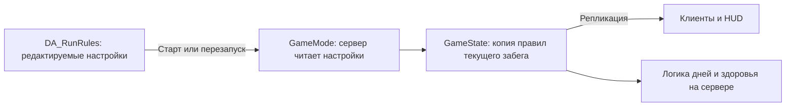

# Разработка по шагам

Каждый шаг добавляет одну понятную систему. Перед работой объясняем её назначение и зависимости, после — где искать изменения и как проверить их в редакторе. Следующий шаг начинается отдельным обсуждением после разбора результата текущего. Целевые механики описаны в [GDD](GDD.md), варианты реализации — в [техническом проекте](SystemsDesign.md).

**Обновление 25.09.2026:** по запросу реализованы следующие четыре пункта вместе: кофе/чистка, общие статусы/лечение, гибель/расход зуба, физическая еда/хват. Их разбор и инструкция проверки находятся в [FirstFourSystems.md](FirstFourSystems.md). Описания шагов 1–2 ниже сохранены как история; прежние пометки «чистка/возрождение/хват позже» теперь закрыты этим обновлением.

## Шаг 1. Правила забега — сделано

**Зачем:** здоровье, число дней и лимит игроков раньше были записаны в нескольких местах кода. Теперь есть один редактируемый набор настроек. Следующие системы смогут получать правила текущего забега из общего состояния игры.

**Главный файл для дизайнера:** `Content/Data/DA_RunRules` в Content Browser Unreal. Открой его и раскрой `Settings`.

| Поле | По умолчанию | Для чего служит сейчас |
| --- | --- | --- |
| `Max Mouth Health` | 100 | Начальное здоровье рта и верхний предел восстановления; полная полоска HUD соответствует этому значению |
| `Days To Survive` | 7 | Сколько дней нужно закончить для победы; это же число показывает HUD |
| `Max Players` | 4 | Ограничение входа новых игроков и число мест в HUD; поддерживается диапазон 1–4 |
| `Initial Arena Teeth` | 8 | Со шага 2 создаёт конкретные зубы арены при старте; возрождения подключаются позже |

Стартовые персонажи в `Initial Arena Teeth` не входят. Доступные зубы считаются по реальным акторам; параметр DA задаёт начальное количество и не убывает во время игры.

### Как данные доходят до игры

DA — шаблон для следующего старта. GameState хранит копию, применённую к текущему забегу. Текущее здоровье находится отдельно в `MouthHealth`. Получение урона не изменяет DA. Изменение настройки в редакторе не перестраивает уже идущий забег; её прочитает следующий запуск или перезапуск хостом через R. Лимит игроков проверяется при подключении и не отключает уже находящихся в сессии людей.

### Где находится код

| Файл | Его роль |
| --- | --- |
| [MCRunRules.h](../Source/MessControl/Public/MCRunRules.h) | Новый тип Data Asset и четыре поля настроек. Здесь добавляются будущие общие правила, когда появится соответствующая система |
| [MCRunRules.cpp](../Source/MessControl/Private/MCRunRules.cpp) | Проверка значений: положительное здоровье/число дней, от одного до четырёх игроков, неотрицательное число зубов |
| [MCGameMode.cpp](../Source/MessControl/Private/MCGameMode.cpp) | Сервер читает DA при старте; использует копию правил для здоровья, победы и приёма игроков |
| [MCGameState.h](../Source/MessControl/Public/MCGameState.h) | `RunSettings` — правила активного забега; `MouthHealth` — текущее здоровье. GameState передаёт правила клиентам |
| [MCPrototypeWidget.cpp](../Source/MessControl/Private/MCPrototypeWidget.cpp) | Показывает число дней/мест из GameState и рассчитывает заполнение полоски здоровья |

Файлы с расширением `.h` описывают доступные данные и функции, `.cpp` содержит их поведение. Для настройки обычных чисел достаточно DA; менять C++ не требуется.

Дополнительно: [create_run_rules.py](../Tools/Unreal/create_run_rules.py) создаёт отсутствующий DA после сборки и сохраняет существующие настройки при повторном запуске. Это служебный скрипт; готовый DA уже входит в репозиторий. [MCGameplayTests.cpp](../Source/MessControl/Private/Tests/MCGameplayTests.cpp) содержит автоматическую проверку использования настроек. Основной генератор контента тоже умеет создать DA при восстановлении проекта с нуля.

### Как проверить самому

1. В Content Browser открой `Content → Data → DA_RunRules`, раскрой `Settings`.
2. Для короткой проверки поставь `Days To Survive = 1`, `Max Mouth Health = 60`, сохрани DA.
3. Запусти Play. HUD должен показать `DAY 01 / 01`, здоровье 60 и полную полоску.
4. Закончи задания первого дня. Должна появиться победа, а не второй день.
5. Останови Play, верни 7 дней и 100 здоровья, сохрани DA.

Автоматический тест использует отдельный временный профиль: 40 здоровья, два дня и два игрока. Он проходит два дня до победы, проверяет предел лечения и отказ третьему игроку, а также изменение профиля только на следующем старте. Рабочий `DA_RunRules` при этом не изменяется. Полный запуск проверок: `Tools/Test.ps1 -Mode Unit`.

### Граница этого шага

Шаг 1 подключил настройки к существующему прототипу. В нём остаются прежние упрощённые задания и правила смены дня. Следующий выполненный шаг описан ниже.

## Шаг 2. Зубы арены и видимые реакции — сделано

**Зачем:** будущему возрождению нужен конкретный зуб, который можно потерять или потратить. Зубы арены — **большие зубы рта в боковых рядах**, за которыми ухаживают игроки. После уточнения оставлены восемь больших зубов: четыре слева, четыре справа. Отдельного ряда маленьких зубов больше нет. Сохранены исходные модели, размеры и выбранные места крупных нижних зубов; вручную добавленная модель `teeth_low` сохранена.

У каждого игрового зуба собственные HP. Это отдельная прочность, не общие 100 HP рта. Доступное количество в HUD вычисляется по живым акторам: выпадение одного даёт 7/8. Смена дня сохраняет повреждения и налёт, новый забег пересоздаёт зубы. ID стабилен внутри забега; сохранение на диск пока не подключено.

### Что можно увидеть

1. **Целый зуб:** глянцевая светлая эмаль, 100 HP.
2. **Кофе:** коричневый узор поверх эмали. Само включение предпросмотра не наносит урон.
3. **Удар ПКМ:** по умолчанию −25 HP, короткая цветовая вспышка, squash/stretch, отдача и затухающее покачивание. Коллизия при сжатии не деформируется.
4. **Расшатывание:** при ≤40% здоровья зуб постоянно качается. Повреждения дополнительно показываются процедурными тёмными линиями на эмали.
5. **Выпадение:** на 0 HP короткая подготовка, затем подброс, вращение, столкновение с полом. Доступное количество уменьшается ровно один раз. Зуб арены — цельный физический объект; скелетный ragdoll персонажей остаётся отдельной системой.

Здесь использованы squash/stretch, anticipation, follow-through, перекрывающееся движение, плавное затухание и преувеличенная амплитуда. Не каждый из 12 принципов применим к каждой реакции. Это редактируемый процедурный прототип, без финальной художественной анимации.

### Где что настраивать

| Ресурс | Назначение |
| --- | --- |
| `Content/Data/DA_ArenaTooth` → `Settings` | HP, порог расшатывания, урон щётки, squash, угол и длительность реакции, подготовка/скорость/подброс выпадения; применяются при новом запуске |
| F1 → прокрутить до `ARENA TEETH / HOST` | Предпросмотр налёта и три ползунка реакции прямо в игре. Только хост; изменения текущей сессии передаются клиентам |
| `Content/Art/Materials/M_ArenaTooth` | `EnamelColor`, `CoffeeColor`, `EnamelRoughness`; `Coffee`, `Damage`, `HitFlash` заполняет состояние зуба |

Ползунки арены действуют только до нового забега. Кнопки `SAVE LOCAL PRESETS` выше относятся к персонажу; настройки арены сохраняй в `DA_ArenaTooth` перед следующим запуском.

### Как проверить самому

1. Открой `L_Mouth`: большие нижние зубы уже видны в редакторе, по четыре с каждой стороны. В Outliner это `ARENA | Tooth 01`…`08`. Нажми Play: эти же места и размеры получают HP и номера, HUD показывает `ARENA TEETH 8 / 8`.
2. Нажми F1, прокрути вниз до `ARENA TEETH / HOST`, нажми `PREVIEW COFFEE ON ARENA`. Закрой F1: на зубах виден налёт.
3. Подойди к одному большому зубу, повернись к нему и нажми ПКМ четыре раза с паузами. После третьего удара он шатается, после четвёртого выпадает на арену; в боковом ряду остаётся пустое место, запас становится 7/8.
4. Для сравнения открой F1 и измени `Arena hit squash`, `Arena wobble degrees`, `Arena reaction seconds`. Проверь реакцию следующего зуба.
5. `CLEAR COFFEE PREVIEW` убирает слой у стоящих зубов. Это служебный предпросмотр материала, не игровая чистка.

### Карта файлов этого шага

| Файл | Его роль |
| --- | --- |
| [MCArenaTooth.h](../Source/MessControl/Public/MCArenaTooth.h), [MCArenaTooth.cpp](../Source/MessControl/Private/MCArenaTooth.cpp) | Тип DA, состояние конкретного зуба, серверный урон, материал, процедурная реакция и физическое выпадение |
| [MCArenaToothSocket.h](../Source/MessControl/Public/MCArenaToothSocket.h), [MCArenaToothSocket.cpp](../Source/MessControl/Private/MCArenaToothSocket.cpp) | Размещение большого зуба в редакторе: стабильный ID, модель, положение и масштаб. Его предпросмотр скрыт в игре, где на том же месте появляется игровой зуб |
| [MCGameMode.cpp](../Source/MessControl/Private/MCGameMode.cpp) | Создаёт зубы на заданных в карте местах из `DA_RunRules` и `DA_ArenaTooth`; внутренний ряд не добавляется |
| [MCGameState.h](../Source/MessControl/Public/MCGameState.h) | Передаёт список зубов клиентам; количество доступных выводится из состояния этих акторов |
| [MCToothCharacter.cpp](../Source/MessControl/Private/MCToothCharacter.cpp) | Удар щётки выбирает ближайшую допустимую цель перед игроком, включая зуб арены; проверка выполняется сервером |
| [MCPrototypeWidget.cpp](../Source/MessControl/Private/MCPrototypeWidget.cpp) | HUD количества, предпросмотр налёта и три ползунка F1 |
| [MCArenaDemo.cpp](../Source/MessControl/Private/MCArenaDemo.cpp) | Только постановка записи: камера и последовательность тех же вызовов урона/налёта. Запускается исключительно флагом `-MCArenaDemo` в Development |
| [create_arena_tooth.py](../Tools/Unreal/create_arena_tooth.py) | Создаёт отсутствующие материал/DA после сборки, сохраняет существующие значения и карту |
| [place_arena_teeth.py](../Tools/Unreal/place_arena_teeth.py) | Однократно переводит исходные нижние ряды в восемь мест игровых зубов и переносит боковые коллизии за них; готовая карта уже сохранена в репозитории |

Для изменения расположения выбирай `ARENA | Tooth NN` в редакторе и двигай/масштабируй как обычный объект. `Tooth Id` должен быть уникальным; число доступных мест ограничивает количество зубов при старте. После выпадения игрового зуба его редакторский предпросмотр не появляется обратно. Верхние дальние зубы остаются частью фонового блокинга. Игровой пол расширен под нижние ряды, боковые стенки стоят снаружи; это позволяет добраться до зубов и физически уронить их на площадку.

### Видео

[Step02_ArenaTeeth.mp4](../Artifacts/Step02_ArenaTeeth.mp4) — запись реального Unreal, 1280×720, 30 кадров/с, без звука. Камера, налёт и четыре удара запускаются по сценарию; физическое падение рассчитывает движок. Это демонстрация поведения, не запись действий живого игрока и не финальный визуал из референсов.

Повторная запись: `Tools/CaptureArenaDemo.ps1` после Editor-сборки. Нужен FFmpeg; путь можно передать параметром `-FFmpeg`. Кадры лежат в `Saved/ArenaDemoFrames`, видео — в `Artifacts`. Генератор заменяет только собственные предыдущие кадры и видео. Обычный Play демонстрацию автоматически не запускает.

### Граница шага

Общая система статусов для героев и зубов, чистка четырьмя контактами, автоматическое нанесение налёта событием кофе, лечение/вставка зуба и расходование зуба на возрождение остаются следующими шагами. Сейчас кофе — отдельный реплицируемый параметр предпросмотра, а повреждённость/расшатанность следуют из HP. Произвольного стека статусов или периодического урона ещё нет. Порог 40% и урон 25 — стартовые числа для настройки.

## Дальнейшая последовательность — план

| Следующий шаг | Что станет проверяемым | На что опирается |
| --- | --- | --- |
| 3. Статусы и контактная чистка — сделано | Кофе на зубе снимается четырьмя успешными стуками; общие статусы и лечение доступны игрокам и арене | [Разбор и проверка](FirstFourSystems.md) |
| 4. Гибель и возрождение — сделано | Новый герой расходует конкретный зуб арены, наследование регулируется DA | [Разбор и проверка](FirstFourSystems.md) |
| 5. Пища и хват — сделано | Предмет падает, сбивает игрока; его можно схватить, вытащить и сдать в горло | [Разбор и проверка](FirstFourSystems.md) |
| 6. Меню и события дня — прототип дня 1 сделан | Завтрак из таблицы, несколько событий внутри дня, HP/масса/фрагменты/порча еды, язвы | [Разбор дня 1](Day01.md) |
| 7. Жидкость — прототип кофе сделан; зевание и движение впереди | Четыре волны, плавучесть ragdoll, подгребание и зацеп за большие зубы | [Разбор дня 1](Day01.md) |
| 8. Резка и полный забег | Разрезанные части можно таскать; последствия сохраняются на семь дней и в сохранениях | Предметы, статусы, события, устойчивые ID |

Технический опыт с разрезом проводится до финальной подготовки моделей пищи. Этот план не запускает последующие шаги автоматически. Перед каждым шагом уточняем только те открытые правила GDD, которые нужны именно ему.

## Подключение модели и рига коллеги — 25.09.2026

Игрок заменён на `SM_Teeth_rig`. `DA_PlayerAppearance` связывает модель, материал, соответствие костей, положение щётки и `PA_TeethPlayer`. Это позволяет менять визуал без переписывания событий дня. Процедурные движения, отлёты, подъём и кофейное плавание адаптированы к новому скелету. Подробности и временные ограничения: [PlayerAppearance.md](PlayerAppearance.md); результаты: [Validation.md](Validation.md).

## Dev-панель механик — 25.09.2026

F3 открывает список этапов из DA_Day01 и дополнительные проверки. Этап запускается с чистого состояния и остаётся активным без автоматического перехода; быстрые действия добавляются поверх для проверки сочетаний. Это позволяет отдельно проверять завтрак, кофе, инфекцию, статусы и возрождение, не проходя обучение каждый раз. [Управление, назначение файлов и ограничения](DevPanel.md).
